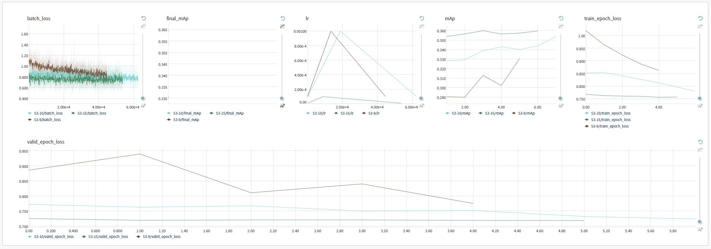

# Open Images 2019 Challenge

My solution using PyTorch and lightGBM for the Open Images v5 Challenges on Kaggle.

- [Object detection track](https://www.kaggle.com/c/open-images-2019-object-detection) for detecting bounding boxes around object instances

- [Visual relationship detection track](https://www.kaggle.com/c/open-images-2019-visual-relationship) for detecting pairs of objects in particular relations

| Challenge        | Public Score           | Private Score  | Position  |
| ------------- |:-------------:| -----:| -----:|
| Object detection track     | 0.43667 | 0.39850 | 129/559 |
| Visual relationship detection track      | 0.15190      |  0.13205 | 29/201 (Silver)|

## Summary of Approaches

Retinanet architecture with 6 separate networks split based on the class hierarchy. Due to the large class imbalances the dataloader selected images based on the equal distribution across all classes.
Training supports multi-gpu and mixed precision. 

Visual Relationship Detection track approach is based on the results of the object detection track and creating a multi-class lightGBM classifier for the 'non-is' relationship and a simple image classifier for the 'is' relationship

Training was monitored using neptune.ml

